# Project-02
Setting Up a Multi-VM Network with Internal Connectivity Using Vagrant and VirtualBox
---
## Project Overview:

In this project, you’ll configure multiple virtual machines (VMs) using Vagrant and VirtualBox, establish internal connectivity, and enable communication between them using a private network. This setup is ideal for simulating distributed systems, multi-tier applications, or isolated environments.

---
## Prerequisites:
Before starting, ensure your system meets the following requirements:

1. **Host System Requirements:** 

*   **Operating System:**
*   Windows: Windows 10 or later (64-bit)
*   macOS: macOS Mojave (10.14) or later
*   Linux: Various distributions (kernel 4.4 or later)
*   Solaris: Solaris 11 or later

*   **Processor:**
*   x86 or AMD64/Intel64 architecture
*   Support for hardware virtualization (Intel VT-x or AMD-V)

*   **RAM:**
*   Minimum: 4 GB (8 GB or more recommended for better performance)

*   **Disk Space:**
*   At least 30 MB for the installation
*   Additional space for virtual machines (depends on the guest OS)

**Guest System Requirements**

*   **Operating System:**
*   Supports a wide range of guest operating systems, including various versions of Windows, Linux distributions, macOS (with limitations), and others.

*   **RAM and Disk Space:**
*   Varies by guest OS; typically, a minimum of 1 GB of RAM is recommended, but this can be higher depending on the OS and applications being run.

**Additional Notes**

*   **Virtualization Support:** Ensure that virtualization support is enabled in the BIOS/UEFI settings of the host machine.

*   **Network:** For networking features, a working network interface is required.

Always refer to the [official VirtualBox documentation](https://https://www.virtualbox.org/manual/ch02.html#system-requirements) for the most accurate and up-to-date information.

## Step-by-Step Implementation:
### Step 1 - Initialize the Project
*   Organize the project files in a dedicated folder:

```
mkdir multi-vm
cd multi-vm
```
*   Generate a default Vagrantfile:
```
vagrant init
```
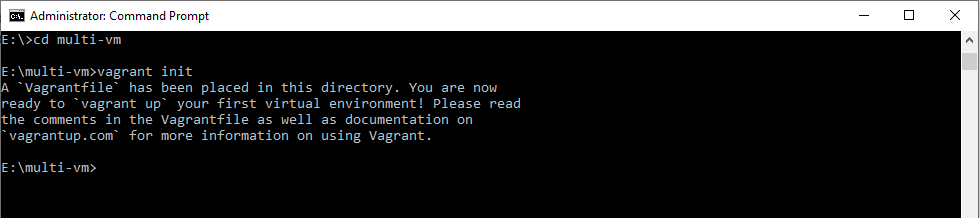

### Step 2 - Configure the Vagrantfile
* Open the Vagrantfile in your preferred text editor:
```
nano Vagrantfile
```
Or:
```
code Vagrantfile
```
*   Replace the default content with the following configuration:
```
Vagrant.configure("2") do |config|
  # VM 1: Application Server
  config.vm.define "app" do |app|
    app.vm.box = "bento/ubuntu-22.04"
    app.vm.hostname = "app.local"
    app.vm.network "private_network", ip: "192.168.56.10"
    app.vm.provider "virtualbox" do |vb|
      vb.memory = "1024"
      vb.cpus = 1
    end
  end

  # VM 2: Database Server
  config.vm.define "db" do |db|
    db.vm.box = "bento/ubuntu-22.04"
    db.vm.hostname = "db.local"
    db.vm.network "private_network", ip: "192.168.56.11"
    db.vm.provider "virtualbox" do |vb|
      vb.memory = "1024"
      vb.cpus = 1
    end
  end
end
```

### Key Configuration Highlights:

### VM Definitions:

*   app: Acts as the application server.
*   db: Serves as the database server.

**Private Network:** Each VM has a private IP for internal communication.

**Resources:** Allocates 1 GB of RAM and 1 CPU core per VM.

### Step 3 - Start the Virtual Machines

*   Bring Up the VMs:
```
vagrant up
```
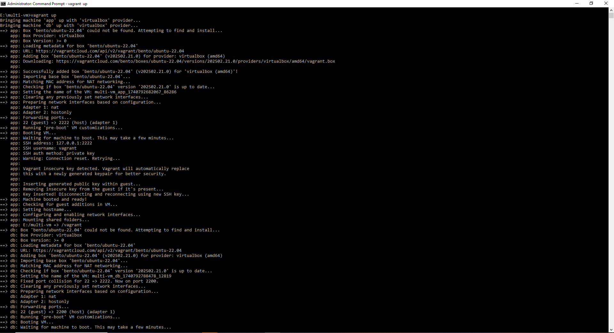
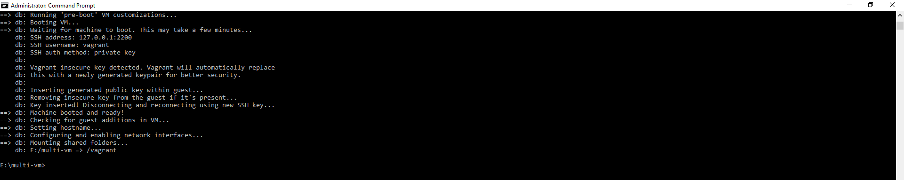
*   Verify the VMs Are Running:
```
vagrant status
```
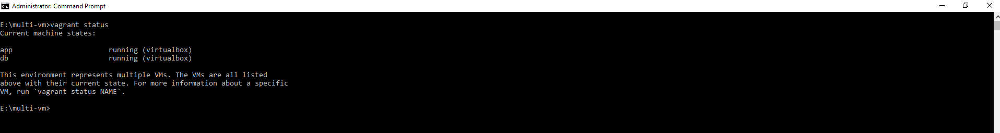

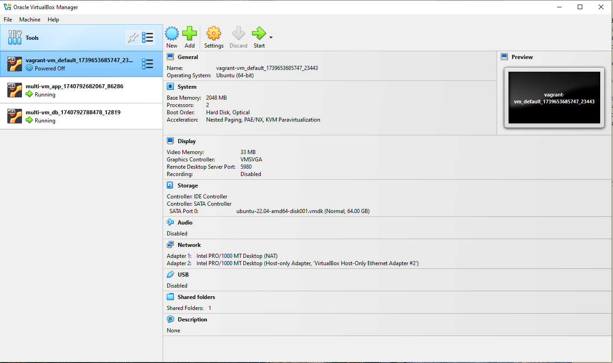

### Step 4 - Test Internal Connectivity
*   SSH into the App VM:
```
vagrant ssh app
```
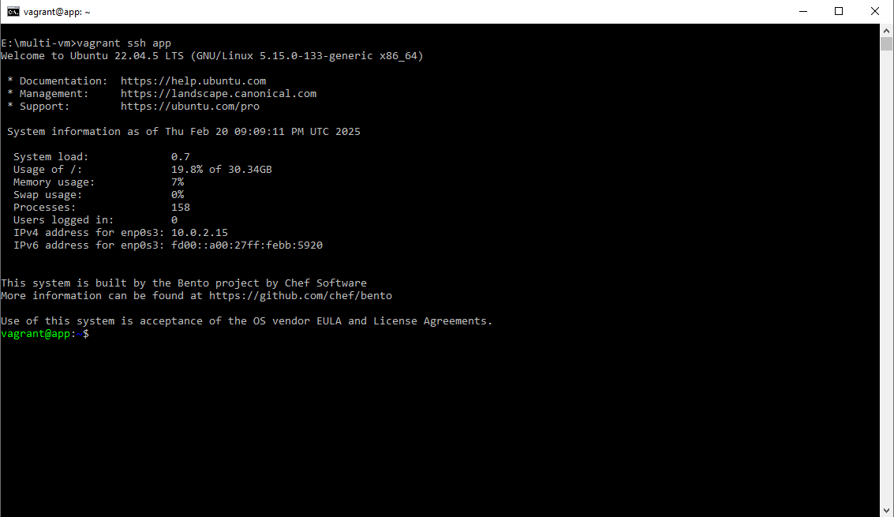

*   Ping the Database VM:
```
ping -c 4 192.168.56.11
```
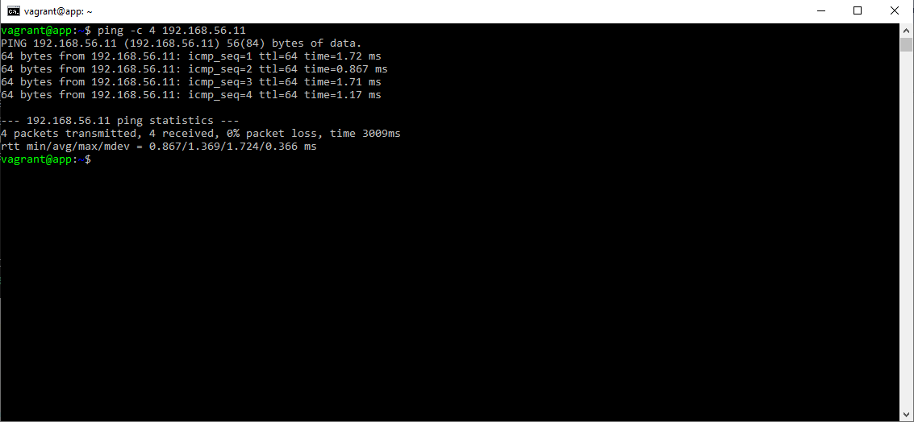

*   Exit the App VM:
```
exit
```
### Step 5 - Configure Services on Each VM
**App Server Configuration:**

*   Access the App VM:
```
vagrant ssh app
```
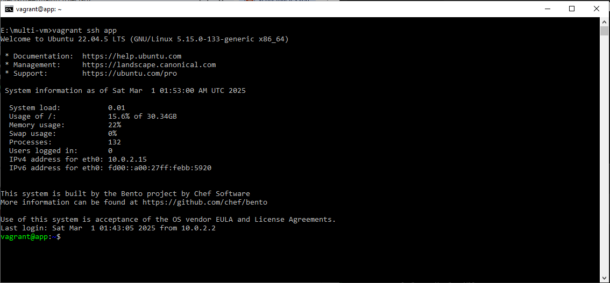

*   Install and Start Apache:

```
sudo apt update
sudo apt install -y apache2
sudo systemctl start apache2
sudo systemctl enable apache2
```
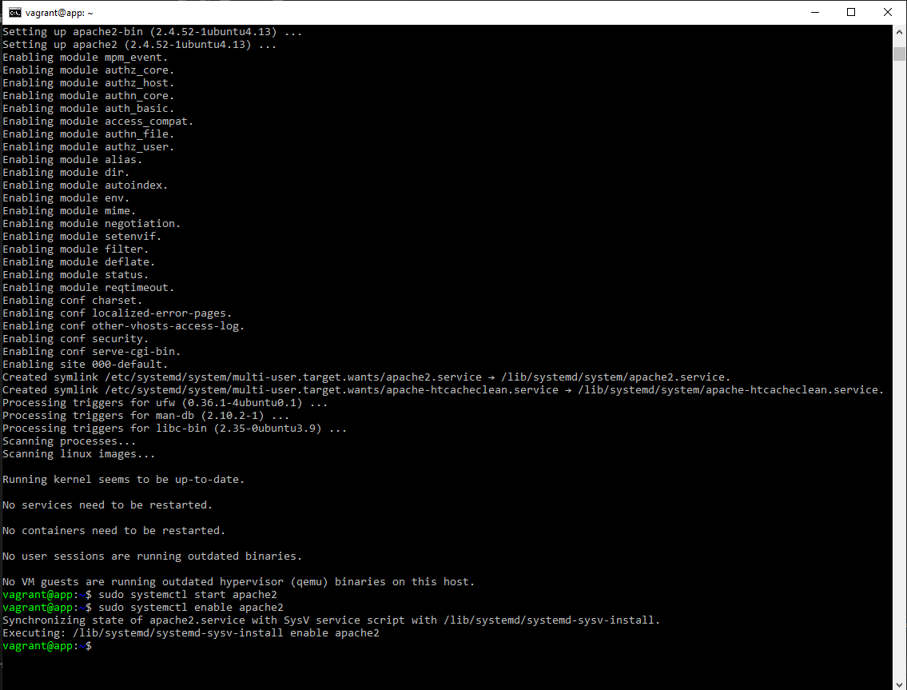
*   Check Apache Status:

```
sudo systemctl status apache2 
```
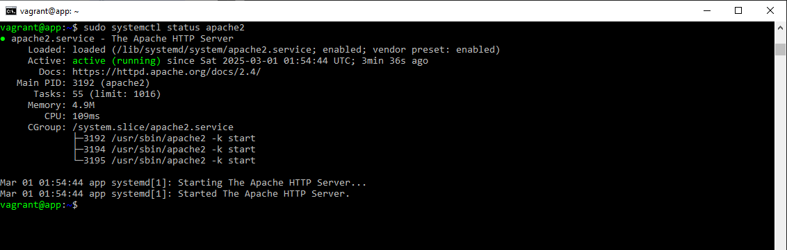

### Database Server Configuration:

*   Access the Database VM:
```
vagrant ssh db
```
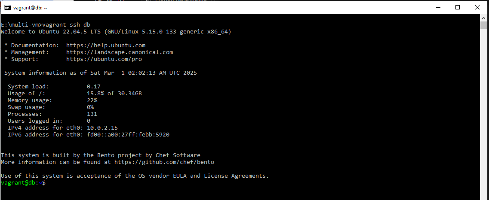

*   Install and Start MySQL:

```
sudo apt update
sudo apt install -y mysql-server
sudo systemctl start mysql
sudo systemctl enable mysql
```
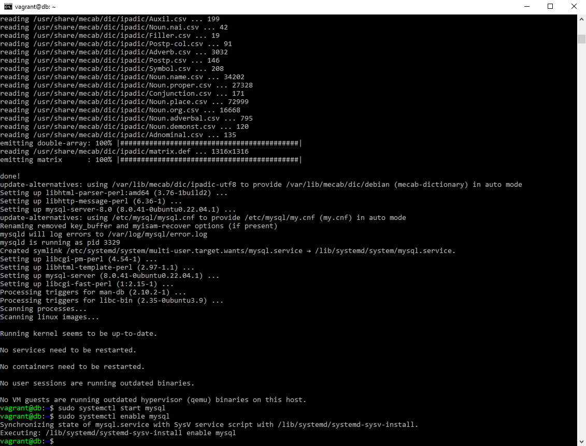
*   Check MySQL Status:

```
sudo systemctl status mysql 
```
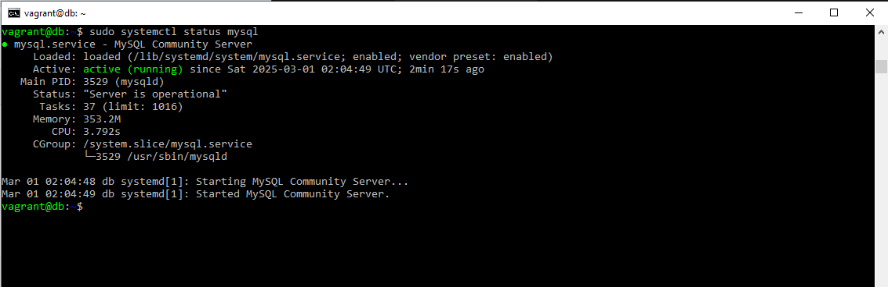

### Step 6 - Advanced Testing
*Test Apache from the Database VM:*

*   SSH into the db VM:

```
vagrant ssh db
```
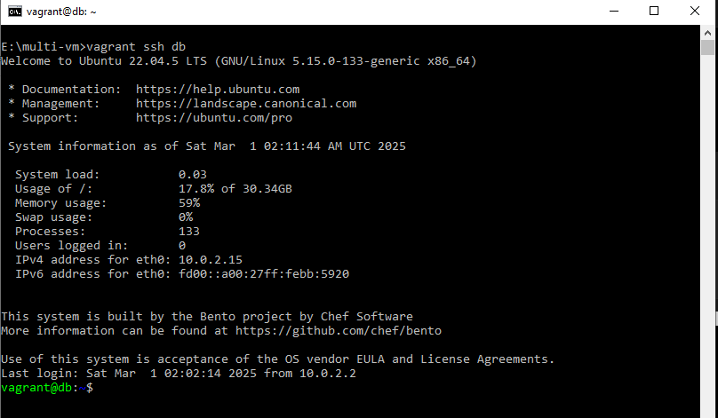

*   Test access to the App Server:

```
curl 192.168.56.10
```

You should see the default Apache HTML page content.

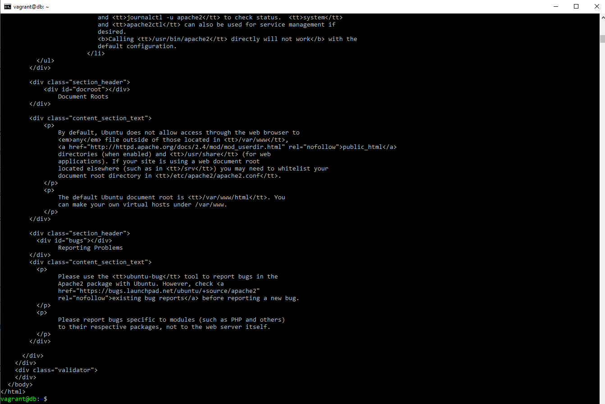

**Test MySQL from the App VM:**

*   From the app VM, test connectivity to the MySQL service on the db VM:

```
mysql -h 192.168.56.11 -u root
```

### Step 7 - Clean Up (Optional)
*   Stop the VMs while preserving their state:

```
vagrant halt
```

*   Remove the VMs completely:

```
vagrant destroy -f
```

## Conclusion
In this project, you:

*   Configured multiple VMs with internal connectivity.

*   Deployed and tested services on the Application and Database servers.

*   Established communication between the VMs using a private network.

This setup demonstrates the foundation for building complex, multi-tiered, and distributed systems in a virtualized environment.

Project Completed!🎉